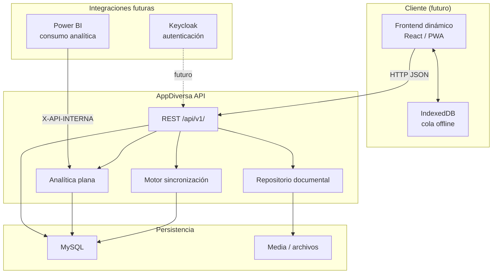

# 01 — Arquitectura Frontend ↔ Backend

Documento de referencia para el frontend dinámico de AppDiversa. Describe la arquitectura implementada en el backend **sin inventar endpoints**.

## Visión general

AppDiversa es un motor de formularios parametrizables. El frontend **no codifica preguntas**: consume estructura, catálogos, reglas y flujos desde la API REST. MySQL es la fuente oficial de datos; el dispositivo solo almacena temporalmente información para operación offline.

## Diagrama de arquitectura

## Capas

| Capa | Responsabilidad |
|------|-----------------|
| **Frontend** | UI dinámica, estado local, IndexedDB, envío de batches |
| **REST** | Contratos JSON bajo `/api/v1/`, Swagger en desarrollo |
| **Backend** | Servicios, permisos, reglas, validación, auditoría |
| **MySQL** | Formularios, sesiones, respuestas, catálogos, sync |
| **Repositorio documental** | Archivos (imágenes, PDF, firmas, multimedia) |
| **Analítica** | Respuestas en formato plano para BI |
| **Power BI** | Consume endpoint analítica con token interno |
| **Keycloak** | No implementado; flujo anónimo MVP actual |
| **IndexedDB** | Solo en cliente; backend no depende de él |

## Principios para el frontend

1. **Parametrización total**: formularios, secciones, preguntas y reglas vienen del backend.
2. **Sesión anónima**: `uuid_sesion` + `token_cliente` protegen mutaciones.
3. **Offline por batch**: único canal autorizado `POST /api/v1/sincronizacion/`.
4. **Idempotencia**: `uuid_local` + `version_cliente` en cada respuesta offline.
5. **Errores funcionales**: respuestas con `{"detalle": "mensaje en español"}`.

## Documentos relacionados

- [02_flujo_completo_aplicacion.md](./02_flujo_completo_aplicacion.md)
- [03_endpoints_publicos.md](./03_endpoints_publicos.md)
- [04_endpoints_protegidos.md](./04_endpoints_protegidos.md)
- [11_seguridad.md](./11_seguridad.md)
