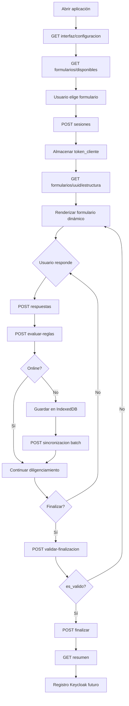

# 02 — Flujo completo de la aplicación

Paso a paso del flujo MVP anónimo implementado en el backend. El frontend debe seguir esta secuencia.

## Diagrama de flujo

## Detalle por etapa

### 1. Abrir aplicación

- Verificar conectividad opcional con `GET /api/v1/salud/`.
- Cargar configuración visual y textos: `GET /api/v1/interfaz/configuracion/?idioma=es`.

### 2. Configuración de interfaz

Respuesta incluye logos, colores, textos legales, SEO y opción de accesibilidad (`incluir_accesibilidad=true`).

### 3. Formularios disponibles

`GET /api/v1/formularios/disponibles/?idioma=es` — lista formularios publicados y vigentes.

### 4. Elegir formulario

El usuario selecciona un ítem; el frontend guarda `uuid` del formulario.

### 5. Crear sesión

`POST /api/v1/sesiones/` con `uuid_sesion` (generado en cliente), `uuid_formulario`, opcional `token_cliente`, `idioma`, `zona_horaria`, `es_offline`.

**Respuesta incluye `token_cliente`** — debe persistirse de forma segura en el cliente.

### 6. Cargar estructura

`GET /api/v1/formularios/{uuid_formulario}/estructura/?idioma=es` — secciones, preguntas, opciones, reglas, catálogos asociados.

### 7. Guardar respuestas

`POST /api/v1/respuestas/` con credenciales de sesión (headers o body). Tras cada guardado relevante, evaluar reglas.

### 8. Evaluar reglas

- Tras cada respuesta: opcional `POST .../preguntas/{codigo}/evaluar-reglas/`.
- O evaluar todo: `POST .../sesiones/{uuid}/evaluar-reglas/`.

El frontend aplica `ResultadoReglasSerializer` (ocultar, mostrar, obligatorias, saltos).

### 9. Guardar parcial / offline

Si `es_offline` o sin red:

- Acumular operaciones en IndexedDB con `uuid_local`, `version_cliente`, `fecha_cliente`, `checksum`.
- No llamar `POST /respuestas/` por cada ítem en offline; usar **batch** al reconectar.

### 10. Sincronización

`POST /api/v1/sincronizacion/` con lote de operaciones. Ver [06_flujo_offline.md](./06_flujo_offline.md).

### 11. Validar finalización

`POST /api/v1/sesiones/{uuid}/validar-finalizacion/` — verifica obligatorias pendientes sin cerrar la sesión.

### 12. Finalizar

`POST /api/v1/sesiones/{uuid}/finalizar/` — cierra sesión si no hay pendientes; 400 con lista de pendientes si falla.

### 13. Resumen

`GET /api/v1/sesiones/{uuid}/resumen/` — respuestas consolidadas para pantalla de confirmación.

### 14. Registro opcional (futuro)

`permite_registro_final` en formulario indica si habrá registro post-envío. Keycloak **no está implementado** en el backend actual.

## Estados de sesión

| Valor | Significado |
|-------|-------------|
| `iniciada` | Sesión creada |
| `en_proceso` | Hay actividad de respuestas |
| `finalizada` | Formulario cerrado |
| `abandonada` | Abandono (admin) |
| `sincronizada` | Marcada tras sync offline |

## Documentos relacionados

- [03_endpoints_publicos.md](./03_endpoints_publicos.md)
- [04_endpoints_protegidos.md](./04_endpoints_protegidos.md)
- [10_finalizacion.md](./10_finalizacion.md)
