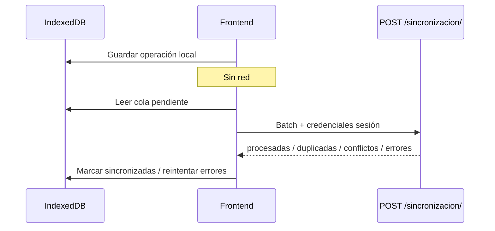

# 06 — Flujo offline

El backend implementa sincronización **solo por lotes** en `POST /api/v1/sincronizacion/`. El frontend **no debe** sincronizar respuesta por respuesta en modo offline.

## IndexedDB (cliente)

Responsabilidad del frontend web (no implementado en backend):

| Almacén | Contenido |
|---------|-----------|
| Estructura | JSON de `GET formularios/{uuid}/estructura/` |
| Sesión | `uuid_sesion`, `token_cliente`, estado |
| Respuestas locales | Valores + metadatos de sync |
| Cola de sync | Operaciones pendientes |
| Estado sync | Último batch, errores, reintentos |

MySQL permanece como fuente oficial; IndexedDB es temporal.

## Identificadores de idempotencia

| Campo | Generado por | Regla |
|-------|--------------|-------|
| `uuid_local` | Dispositivo | UUID único, **nunca cambia** tras crearse |
| `version_cliente` | Dispositivo | Entero; incrementa en cada edición local |
| `fecha_modificacion_cliente` | Dispositivo | Timestamp de la última edición local |
| `dispositivo_origen` | Backend al sync | Identificador del dispositivo en el batch |

### Reglas del servidor

1. Mismo `uuid_local` **no crea** otra respuesta.
2. Actualiza solo si `version_cliente` recibida **>** almacenada.
3. Si versión recibida **<** almacenada → conflicto (Last Write Wins + registro).
4. Si versión **igual** → operación **duplicada** (sin cambio).

## Batch de sincronización

### Request

```http
POST /api/v1/sincronizacion/
X-Sesion-Anonima: {uuid_sesion}
X-Token-Sesion: {token_cliente}
Content-Type: application/json
```

```json
{
  "uuid_sesion": "f47ac10b-58cc-4372-a567-0e02b2c3d479",
  "token_cliente": "xY9kL2mN...",
  "dispositivo": "web-indexeddb-chrome-120",
  "version_app": "1.0.0",
  "operaciones": [
    {
      "uuid_local": "a1a1a1a1-b2b2-c3c3-d4d4-e5e5e5e5e5e5",
      "codigo_pregunta": "P_EDAD",
      "valor": 42,
      "version_cliente": 1,
      "fecha_cliente": "2026-06-28T10:00:00+00:00",
      "checksum": "e3b0c44298fc1c149afbf4c8996fb92427ae41e4649b934ca495991b7852b855"
    }
  ]
}
```

### Response 200

```json
{
  "operaciones_procesadas": 1,
  "operaciones_actualizadas": 1,
  "duplicadas": 0,
  "conflictos": [],
  "errores": []
}
```

### Procesamiento transaccional

- Cada operación se procesa en su propia transacción.
- Una operación fallida **no cancela** las demás del lote.
- Resultado individual en `conflictos[]` o `errores[]`.

## Checksum

Cálculo en cliente (equivalente al backend):

```
SHA-256(JSON canónico de:
  { "codigo_pregunta", "valor", "version_cliente" }
  con sort_keys=true)
```

Si `checksum` se envía y no coincide → error funcional en `errores[]`:

```json
{"uuid_local": "...", "mensaje": "El checksum de la operación no es válido."}
```

Si `checksum` está vacío, el servidor **no valida** checksum.

## Conflictos

Estrategia inicial: **Last Write Wins** por `version_cliente`; empate por `fecha_modificacion_cliente`.

| `tipo_conflicto` | Situación |
|------------------|-----------|
| `version` | Versión cliente menor que servidor |
| `duplicado` | Distinto `uuid_local` para misma pregunta |
| `eliminado` | Respuesta eliminada en servidor |
| `modificacion` | Misma versión, distinto valor |
| `otro` | Casos residuales |

El conflicto se **registra siempre** en `ConflictoSincronizacion` sin perder `valor_cliente` ni `valor_servidor`.

Ejemplo en respuesta:

```json
{
  "conflictos": [
    {
      "uuid_local": "a1a1a1a1-b2b2-c3c3-d4d4-e5e5e5e5e5e5",
      "mensaje": "Conflicto de versiones entre cliente y servidor.",
      "respuesta_id": 15
    }
  ]
}
```

## Reintentos

El backend registra cada intento en `OperacionSincronizacion` con:

- `numero_reintentos`
- `ultimo_error`
- `estado`: `pendiente`, `procesando`, `sincronizada`, `conflicto`, `error`, `cancelada`

El frontend debe:

1. Reenviar solo operaciones en error o pendientes.
2. Incrementar `version_cliente` solo al editar localmente (no en reintento del mismo valor).
3. Mantener el mismo `uuid_local` para la misma respuesta lógica.

## Origen de respuesta tras sync

Tras sincronización exitosa, `origen_respuesta` en servidor = `sincronizacion` y `requiere_sincronizacion` = `false`.

## Flujo recomendado en cliente



## Documentos relacionados

- [04_endpoints_protegidos.md](./04_endpoints_protegidos.md)
- [11_seguridad.md](./11_seguridad.md)
