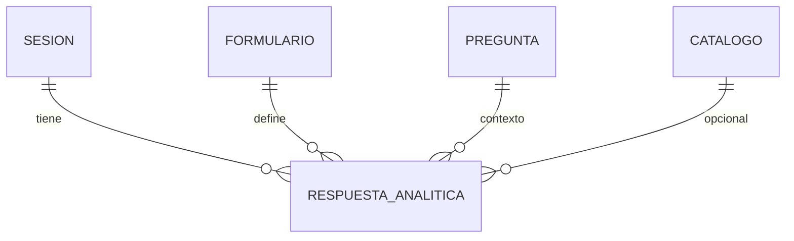

# 13 — Power BI y analítica

El endpoint analítico expone respuestas en **formato plano** (una fila por respuesta) para BI, exportaciones y Power BI.

## Endpoint

```http
GET /api/v1/analitica/respuestas/
X-API-INTERNA: {API_INTERNA_TOKEN}
```

**No disponible para el frontend público.** Consumir desde:

- Power BI (conector web / script Python)
- Herramientas ETL
- `POST /exportaciones/analitica/` para archivos

## Filtros (query)

| Parámetro | Descripción |
|-----------|-------------|
| `formulario_codigo` | Código del formulario |
| `fecha_inicio` | Inicio rango (sesión o respuesta) |
| `fecha_fin` | Fin rango |
| `estado_sesion` | `iniciada`, `en_proceso`, `finalizada`, etc. |

Todos opcionales.

## Formato de respuesta

Array de objetos `RespuestaAnalitica` — ver [05_modelos_json.md](./05_modelos_json.md#analitica-registro-plano).

Campos clave para BI:

| Campo | Uso en reportes |
|-------|-----------------|
| `formulario_codigo`, `formulario_nombre` | Dimensión formulario |
| `seccion_codigo`, `pregunta_codigo` | Dimensión pregunta |
| `respuesta_valor`, `respuesta_numero`, `respuesta_texto` | Medidas / valores |
| `tipo_pregunta` | Tipo de dato |
| `catalogo_codigo`, `catalogo_nombre` | Join con catálogos |
| `uuid_sesion` | Clave de sesión |
| `estado_sesion` | Filtro completados |
| `origen_respuesta` | Web vs offline vs sync |
| `es_offline`, `es_anonima` | Flags |
| `fecha_respuesta_servidor` | Serie temporal |

## Power BI — recomendaciones

### Conexión

1. **Opción A**: Web connector con URL base + header `X-API-INTERNA` (Power Query personalizado).
2. **Opción B**: Exportación periódica vía `POST /exportaciones/analitica/` (CSV/XLSX) y carga desde archivo.
3. **Opción C**: Pipeline ETL que llama API y escribe en staging MySQL.

### Modelo de datos sugerido



- Tabla de hechos: una fila = una respuesta.
- Dimensión sesión: agrupar por `uuid_sesion`.
- Dimensión pregunta: `pregunta_codigo` + `pregunta_texto`.

### Buenas prácticas

- Filtrar `estado_sesion=finalizada` para reportes de completados.
- Usar `fecha_respuesta_servidor` para incremental refresh.
- Normalizar `respuesta_valor` (JSON) en Power Query según `tipo_pregunta`.
- No almacenar `API_INTERNA_TOKEN` en reportes publicados sin gateway seguro.

## Exportación analítica (alternativa)

```http
POST /api/v1/exportaciones/analitica/
X-API-INTERNA: {token}
Content-Type: application/json

{
  "formato": "csv",
  "parametros": {
    "formulario_codigo": "encuesta_salud",
    "fecha_inicio": "2026-01-01",
    "fecha_fin": "2026-12-31"
  }
}
```

Consultar estado: `GET /api/v1/exportaciones/{uuid_exportacion}/`.

## Documentos relacionados

- [04_endpoints_protegidos.md](./04_endpoints_protegidos.md)
- [05_modelos_json.md](./05_modelos_json.md)
