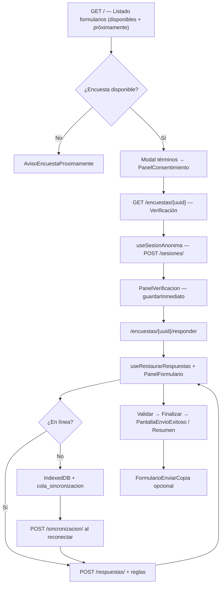
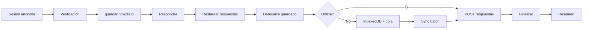

# Informe completo del estado del frontend — AppDiversa UI

**Fecha:** 30 de junio de 2026 (auditoría ampliada — auth, admin, modales, contacto)  
**Proyecto:** `appdiversa-ui`  
**Versión package:** 0.1.0  
**Alcance:** Auditoría técnica del código en `src/` (~412 archivos), pruebas (330 unitarios + 14 E2E), módulos parciales disponibles para desarrollo futuro, brechas respecto al checklist AppDiversa e historial de implementación por fases (1–7).

---

## 1. Resumen ejecutivo

AppDiversa UI es un frontend **dinámico y parametrizable** para un motor de formularios. El **flujo público anónimo principal** (listar formularios → términos/consentimiento → verificación → responder → sincronizar offline → finalizar → resumen/envío exitoso) está **operativo de punta a punta** y cubierto por pruebas E2E.

Desde la auditoría anterior se implementó un **bloque mayor de producto**:

- **Autenticación Django por sesión** (`authServicio`, `authStore`, `useAuthInicial`, `RutaProtegida`, login/registro/perfil/salir, restaurar contraseña).
- **Panel administrativo** (`/admin/*`) con CRUD de formularios, editores (secciones, preguntas, opciones, reglas, textos), vista previa, usuarios y pantalla 403.
- **Historial de respuestas** (`/mis-respuestas`) con tarjetas y paginación desde API.
- **Flujo de modales del formulario** (`useFlujoModalesFormulario`, términos, salir sin guardar, login/registro, encuesta guardada, panel consentimiento).
- **Contacto funcional** (`FormularioContacto`, `contactoServicio`, E2E).
- **Encuestas próximamente** (`formularioDisponibilidad`, `AvisoEncuestaProximamente`, fechas de lanzamiento).
- **Envío de copia por correo** (`FormularioEnviarCopia`, `enviarCopiaRespuestas`).
- **Navegación global** (`MenuHamburguesa`, `MenuPerfil`, `InicializadorAuth`).
- **IndexedDB v3** — tabla `aceptaciones_terminos`.
- **Ampliación de tests**: **330 unitarios** / **86 archivos**; **14 E2E** / **8 specs**.

| Dimensión | % estimado | Estado |
|-----------|------------|--------|
| **Flujo core anónimo** | **~95 %** | Modales, términos, proximamente, envío exitoso |
| **Motor de formularios (18 tipos + grupos catálogo)** | **~94 %** | zodResolver + grupos geográficos |
| **Autenticación / sesión Django** | **~88 %** | Login, perfil, historial, admin protegido |
| **Panel administrativo** | **~85 %** | CRUD formularios + editores + usuarios |
| **Offline / IndexedDB** | **~91 %** | Cola batch + aceptaciones términos locales |
| **Producto completo (checklist AppDiversa)** | **~82 %** | Power BI, PWA avanzada y CI pendientes |
| **Calidad (servicios/hooks/utils/stores)** | **~94,6 %** cobertura líneas | Casi en umbral CI (95 %) |

**Quality gates actuales (última verificación — 30 jun 2026):**

| Gate | Resultado |
|------|-----------|
| `npm run typecheck` | OK |
| `npm run test` | **330 tests** / **86 archivos** |
| `npm run test:coverage` | **94,6 %** líneas / **94,6 %** statements (umbral CI: 95 %) — **casi cumple** |
| `npm run test:e2e` | **14 tests** / **8 archivos** Playwright |
| `npm run lint` | OK (1 warning en `coverage/`, sin errores en `src/`) |

---

## 1.1 Módulos no desarrollados en su totalidad — disponibles para desarrollo futuro

Estos módulos **existen parcialmente** o tienen **esqueleto** en el repositorio. El resto del producto (flujo anónimo, auth Django, admin, contacto, modales, historial) ya está operativo — ver secciones 5–12.

| Módulo | Ubicación | % impl. | Qué hay hoy | Qué falta para completarlo |
|--------|-----------|---------|-------------|----------------------------|
| **Login social Keycloak (Google/Facebook)** | `auth/login`, `BotonSocial` | **~40 %** | Botones opcionales vía `NEXT_PUBLIC_KEYCLOAK_GOOGLE_URL` / `FACEBOOK` | Callback OIDC completo, registro social end-to-end |
| **Analytics / Power BI** | `src/modules/analytics/` | **~5 %** | Esqueleto: `dashboard`, `visor_bi`, `reportes` | Rutas App Router, embed Power BI, servicios protegidos |
| **Centro de notificaciones** | `NotificationCenter.tsx` | **~0 %** | Montado en layout; retorna `null` | Store, UI desplegable, notificaciones persistentes |
| **PWA avanzada** | `public/sw.js`, `manifest.ts` | **~55 %** | SW básico + manifest estático | Precache, iconos backend, install prompt |
| **Cola offline de archivos** | `useSubirArchivo` | **~25 %** | Bloqueo si offline | Cola IndexedDB para subidas diferidas |
| **Internacionalización completa** | `useIdioma`, `traduccionesUi` | **~80 %** | Cookies SSR, API, selector | Merge `traducir()` en textos estáticos restantes |
| **CI/CD pipeline** | *(no existe `.github/`)* | **0 %** | Scripts npm listos | GitHub Actions con quality gates |
| **Export PDF resumen** | `ResumenSesion`, `/resumen` | **~88 %** | Resumen + envío copia por correo | Export PDF descargable |
| **Grabación in-browser audio/video** | `PreguntaAudio`, `PreguntaVideo` | **~78 %** | Subida multipart | Captura desde dispositivo |
| **Paginación historial completa** | `/mis-respuestas` | **~75 %** | Primera página + tarjetas | Navegación páginas siguientes en UI |
| **Registro por correo completo** | `/auth/registro/correo` | **~70 %** | Formulario base | Verificación email, flujo post-registro |
| **Barra accesibilidad clásica** | `001_barra_accesibilidad/` | **~80 %** | Componente funcional no montado | Deprecar o unificar con `BarraFlotante` |

---

## 2. Stack tecnológico

### 2.1 Producción

| Tecnología | Versión | Uso en el proyecto |
|------------|---------|-------------------|
| **Next.js** | 16.2.9 | App Router, SSR, `layout.tsx`, rutas dinámicas, `manifest.ts` |
| **React** | 19.2.4 | Componentes cliente/servidor, Strict Mode |
| **TypeScript** | ^5 | Modo strict, tipos derivados de OpenAPI en `src/types/` |
| **Tailwind CSS** | ^4 | Layout, espaciado, responsive; colores vía CSS custom properties |
| **Zustand** | ^5.0.3 | **11 stores** de estado cliente |
| **Axios** | ^1.7.9 | Cliente HTTP central en `src/services/api.ts` |
| **React Hook Form** | ^7.54.2 | Formulario dinámico en `PanelFormulario` |
| **Zod** | ^3.24.1 | Validación dinámica por pregunta (`esquemaFormularioZod.ts`) |
| **Dexie.js** | ^4.0.10 | IndexedDB v2 — 6 tablas + índice compuesto en cola |
| **isomorphic-dompurify** | ^3.x | Sanitización HTML en textos legales y contenido accesible |
| **@hookform/resolvers** | ^5.4.0 | Integrado con `zodResolver` en `PanelFormulario` |

### 2.2 Desarrollo y calidad

| Tecnología | Uso |
|------------|-----|
| **Vitest** | Tests unitarios (**330 tests** / **86 archivos**) |
| **React Testing Library** | Tests de componentes |
| **Playwright** | **14 tests** E2E / **8 specs** con mock API (`e2e/mockApi.mjs`) |
| **fake-indexeddb** | Tests de Dexie en Node |
| **ESLint** | `eslint-config-next` |
| **jsdom** | Entorno DOM para Vitest |

### 2.3 Scripts npm

```text
dev | build | start | lint | typecheck
test | test:watch | test:coverage | test:ui | test:e2e
```

### 2.4 Variables de entorno

| Variable | Obligatoria | Uso |
|----------|-------------|-----|
| `NEXT_PUBLIC_API_BASE_URL` | Sí | Base URL de la API |
| `NEXT_PUBLIC_KEYCLOAK_GOOGLE_URL` | No | Login social Google en `/auth/login` |
| `NEXT_PUBLIC_KEYCLOAK_FACEBOOK_URL` | No | Login social Facebook en `/auth/login` |

---

## 3. Arquitectura y estructura

```text
src/  (~412 archivos)
├── app/                    # Rutas Next.js (30 archivos)
│   ├── contacto/, terminos-condiciones/
│   ├── auth/               # login, registro, registro/correo, perfil, salir, restaurar-password
│   ├── mis-respuestas/
│   ├── admin/              # panel CRUD formularios + usuarios
│   └── encuestas/[uuid]/, responder/, resumen/
├── components/
│   ├── accesibilidad/      # 3 módulos
│   ├── admin/              # 12 módulos (editores, listados, 403)
│   ├── auth/               # 11 módulos (ventana auth, login, permisos, rutas)
│   ├── contacto/           # formulario contacto
│   ├── formularios/        # 12 módulos (panel, modales, consentimiento, proximamente…)
│   ├── layout/             # 11 módulos + ProveedorAccesibilidad + SW
│   ├── mis-respuestas/     # tarjeta historial
│   ├── offline/            # 3 módulos
│   ├── preguntas/          # 18 tipos + grupo catálogo + renderizador
│   └── ui/                 # 16 módulos (botón, modales 011–016, campos, proveedores…)
├── hooks/                  # 13 hooks
├── modules/analytics/      # Esqueleto Power BI (sin rutas)
├── services/               # 14 servicios + api.ts
├── storage/                # 9 módulos Dexie (schema v3)
├── store/                  # 11 stores Zustand
├── styles/                 # tokens.css, accesibilidad.css
├── tests/                  # setup Vitest
├── types/                  # 13 archivos (auth, admin, contacto…)
└── utils/                  # 24+ helpers

public/
└── sw.js                   # Service Worker PWA básico

e2e/                        # Playwright + mockApi.mjs
docs/informes/              # Informe unificado de estado del frontend
docs/contexto/              # Documentación backend/OpenAPI (referencia)
```

### 3.1 Principios arquitectónicos aplicados

- **Backend como fuente de verdad:** preguntas, opciones, textos, colores y logos vienen de la API.
- **Servicios centralizados:** ningún `fetch`/`axios` directo en componentes complejos.
- **Renderizado dinámico:** un solo `RenderizadorPregunta` mapea `tipo_pregunta`.
- **Offline first parcial:** respuestas y cola en IndexedDB; sync batch al reconectar.
- **Autenticación dual:** sesión anónima (headers) + sesión Django (cookies `withCredentials`) para admin e historial.
- **Tokens dinámicos:** `aplicarTokensInterfaz()` inyecta CSS custom properties desde la configuración de interfaz.
- **i18n híbrido:** cookies SSR (`appdiversa_idioma`, `appdiversa_incluir_accesibilidad`) + store cliente + traducciones API.

---

## 4. Cómo funciona el sistema (flujo end-to-end)



### 4.1 Capas de responsabilidad

| Capa | Responsabilidad | Ejemplos |
|------|-----------------|----------|
| **`app/`** | Rutas, composición SSR, metadata | `page.tsx`, `layout.tsx`, cookies idioma |
| **`components/`** | UI reutilizable | `PanelFormulario`, `ResumenSesion`, `ContenidoAccesiblePregunta` |
| **`hooks/`** | Orquestación cliente | `useGuardarRespuesta`, `useRestaurarRespuestas`, `useIdioma` |
| **`services/`** | Llamadas HTTP tipadas | `sesionesServicio`, `internacionalizacionServicio` |
| **`store/`** | Estado global cliente | `useSesionStore`, `useIdiomaStore` |
| **`storage/`** | Persistencia IndexedDB | `colaSincronizacion`, `catalogosCache` |
| **`utils/`** | Funciones puras | `respuestaDesdeServidor`, `sanitizarHtml`, `obtenerIdiomaServidor` |
| **`types/`** | Contratos compartidos | `formulario.ts`, `accesibilidad.ts` |

---

## 5. Rutas y páginas

### 5.1 Rutas públicas y flujo de encuesta

| Ruta | Archivo | Render | % impl. | Detalle |
|------|---------|--------|---------|---------|
| `/` | `app/page.tsx` | SSR | **94 %** | Listado + encuestas próximamente + sync store |
| `/encuestas/[uuid]` | `page.tsx` + `PanelVerificacion` | SSR + client | **92 %** | Modales términos, consentimiento, verificación |
| `/encuestas/[uuid]/responder` | `responder/page.tsx` + `PanelFormulario` | SSR + client | **95 %** | zodResolver, modales, sync automática, barra acciones |
| `/encuestas/[uuid]/resumen` | `resumen/page.tsx` + `ResumenSesion` | SSR + client | **90 %** | Resumen + envío copia por correo |
| `/contacto` | `contacto/page.tsx` | SSR + client | **90 %** | `FormularioContacto` + POST `/contacto/` |
| `/terminos-condiciones` | `terminos-condiciones/page.tsx` | SSR | **88 %** | Textos legales desde API |
| `manifest` | `app/manifest.ts` | estático | **55 %** | Manifest + SW básico |
| `loading.tsx` | encuestas | estático | **100 %** | SkeletonFormulario |

### 5.2 Autenticación (`/auth/*`)

| Ruta | % impl. | Detalle |
|------|---------|---------|
| `/auth/login` | **90 %** | `FormularioLogin` Django + botones sociales opcionales |
| `/auth/registro` | **85 %** | `OpcionesRegistro`, enlaces a registro correo |
| `/auth/registro/correo` | **70 %** | Formulario registro por correo |
| `/auth/perfil` | **85 %** | Perfil autenticado (`RutaProtegida`) |
| `/auth/salir` | **90 %** | Cierre sesión Django |
| `/auth/solicitar-restaurar-password` | **90 %** | Solicitud restauración |
| `/auth/restaurar-password` | **90 %** | Restablecer con token |

### 5.3 Usuario autenticado

| Ruta | % impl. | Detalle |
|------|---------|---------|
| `/mis-respuestas` | **80 %** | Historial paginado (`GET /sesiones/historial/`) |

### 5.4 Panel administrativo (`/admin/*`)

| Ruta | % impl. | Detalle |
|------|---------|---------|
| `/admin` | **85 %** | Dashboard + `MenuLateralAdmin` |
| `/admin/formularios` | **88 %** | Listado CRUD |
| `/admin/formularios/nuevo` | **85 %** | Crear formulario |
| `/admin/formularios/[id]` | **85 %** | Detalle |
| `/admin/formularios/[id]/editor` | **82 %** | Editores secciones/preguntas/opciones/reglas/textos |
| `/admin/formularios/[id]/versiones` | **80 %** | Versiones |
| `/admin/usuarios` | **78 %** | Listado usuarios admin |

Todas las rutas `/admin/*` usan `RutaProtegida` + layout con menú lateral.

---

## 6. Servicios API (`src/services`)

| Servicio | Endpoints | Consumido en UI | % impl. |
|----------|-----------|-----------------|---------|
| `api.ts` | Cliente Axios + interceptor 403 + `withCredentials` | Global | **95 %** |
| `authServicio.ts` | login, logout, me, cambiar/restaurar password | Auth, admin, perfil | **92 %** |
| `formulariosAdminServicio.ts` | CRUD admin formularios, secciones, preguntas, reglas | Panel `/admin/*` | **88 %** |
| `usuariosAdminServicio.ts` | listado/gestión usuarios admin | `/admin/usuarios` | **80 %** |
| `contactoServicio.ts` | `POST /contacto/` | `/contacto` | **95 %** |
| `interfazServicio.ts` | configuración + textos flujo formulario | Layout, modales, términos | **92 %** |
| `formulariosServicio.ts` | disponibles + estructura + cache | Home, encuestas | **92 %** |
| `sesionesServicio.ts` | sesiones, respuestas, finalizar, resumen, historial, enviar-copia | Flujo encuesta, historial | **92 %** |
| `respuestasServicio.ts` | `POST /respuestas/` | `useGuardarRespuesta` | **95 %** |
| `reglasServicio.ts` | evaluar-reglas | Guardado, sync | **90 %** |
| `catalogosServicio.ts` | catálogos + items + hijos | `useOpcionesPregunta` | **78 %** |
| `archivosServicio.ts` | multipart + descargar | Preguntas media | **85 %** |
| `sincronizacionServicio.ts` | batch sync | `useSincronizacionOffline` | **95 %** |
| `saludServicio.ts` | heartbeat | `useConectividad` | **95 %** |
| `internacionalizacionServicio.ts` | traducciones | `useIdioma` | **78 %** |

**Exportados en** `src/services/index.ts`: incluye `authServicio`, `formulariosAdminServicio`, `usuariosAdminServicio` (no exporta `contactoServicio` — consumo directo).

**Headers de sesión anónima:** `X-Sesion-Anonima`, `X-Token-Sesion` (via `headersSesion.ts`). **Auth Django:** cookies HTTP (`withCredentials: true`).

---

## 7. Stores Zustand (`src/store`)

| Store | % impl. | Estado real |
|-------|---------|-------------|
| `useAuthStore` | **90 %** | **Nuevo** — sesión Django, permisos, roles, login/logout |
| `useSesionStore` | **95 %** | Activo — credenciales sesión anónima |
| `useRespuestasStore` | **92 %** | Activo — valores + restauración desde servidor |
| `useReglasStore` | **90 %** | Activo — resultado motor de reglas |
| `useOfflineStore` | **92 %** | Activo — conectividad, cola, sync, `finalizacionPendiente` |
| `useAccesibilidadStore` | **85 %** | Activo — contraste, tamaño texto, animaciones |
| `useIdiomaStore` | **80 %** | Activo — idioma, traducciones, `incluirAccesibilidad` |
| `useUiStore` | **88 %** | Carga global, toasts, diálogos, confirmaciones |
| `useCatalogosStore` | **75 %** | Cache en memoria usado por `useOpcionesPregunta` |
| `useFormulariosStore` | **75 %** | Estructura/sección en panel; sync SSR en home |
| `useInterfazStore` | **85 %** | Config vía `AppThemeProvider`; textos flujo formulario |

**Nota:** `idiomaStore` no se exporta en `store/index.ts` (consumo directo desde hooks).

---

## 8. Hooks (`src/hooks`)

| Hook | % impl. | Función |
|------|---------|---------|
| `useAuthInicial` | **88 %** | **Nuevo** — carga perfil Django al montar app |
| `useFlujoModalesFormulario` | **90 %** | **Nuevo** — términos, salir, login/registro, encuesta guardada |
| `useSesionAnonima` | **90 %** | Crear/restaurar sesión anónima (API + IndexedDB) |
| `useGuardarRespuesta` | **95 %** | Debounce + `guardarInmediato()` para verificación |
| `useRestaurarRespuestas` | **88 %** | GET `/respuestas/` → RHF + store |
| `useSincronizacionOffline` | **88 %** | Batch sync, errores/conflictos, reglas post-sync |
| `useSincronizacionAutomatica` | **88 %** | Sync al reconectar + finalización offline pendiente |
| `useConectividad` | **90 %** | `navigator.onLine` + heartbeat `/salud/` |
| `useOpcionesPregunta` | **85 %** | Catálogos con filtro padre, cache Dexie + store |
| `useSubirArchivo` | **82 %** | Multipart; bloqueo si offline |
| `useIdioma` | **80 %** | Cookies, traducciones API, refresh SSR |
| `useAccesibilidad` | **80 %** | Sincroniza `data-*` en `<html>` |
| `useFocusTrap` | **90 %** | **Nuevo** — trampa de foco en modales |

**Tests de hooks:** **12/13 archivos** con tests (~92 %). Varios hooks nuevos no exportados en `hooks/index.ts`.

---

## 9. Helpers y utilidades (`src/utils`)

| Utilidad | % impl. | Descripción |
|----------|---------|-------------|
| `erroresApi.ts` | **95 %** | `ErrorApi`, parseo `{ detalle }` |
| `headersSesion.ts` | **100 %** | Headers de sesión anónima |
| `checksum.ts` | **95 %** | SHA-256 para operaciones offline |
| `generarUuid.ts` | **100 %** | UUID v4 cliente |
| `tokensInterfaz.ts` | **90 %** | CSS custom properties + vigencia |
| `motorReglasUi.ts` | **88 %** | Visibilidad, habilitación, saltos |
| `validacionPregunta.ts` | **90 %** | Validación por tipo + valores iniciales RHF |
| `esquemaFormularioZod.ts` | **85 %** | Esquemas Zod; `safeParse` manual |
| `textosFormulario.ts` | **80 %** | Textos legales/confirmación |
| `extraerCodigoCatalogo.ts` | **100 %** | Extrae código de catálogo |
| `itemsCatalogoAopciones.ts` | **100 %** | Mapeo items → opciones |
| `sanitizarHtml.ts` | **95 %** | **Nuevo** — DOMPurify isomórfico |
| `respuestaDesdeServidor.ts` | **90 %** | **Nuevo** — mapeo respuesta API → valor formulario |
| `traduccionesUi.ts` | **85 %** | **Nuevo** — mapa de traducciones API |
| `idiomaCookie.ts` | **95 %** | **Nuevo** — cookies idioma y accesibilidad |
| `obtenerIdiomaServidor.ts` | **95 %** | Lectura cookies en SSR |
| `preguntasCatalogoAgrupadas.ts` | **74 %** | Agrupación geográfica padre-hijo |
| `aplicarTemaDocumento.ts` | **95 %** | Tokens de tema en documento |
| `formularioDisponibilidad.ts` | **92 %** | **Nuevo** — vigencia y estado próximamente |
| `formatearFechaLanzamiento.ts` | **95 %** | **Nuevo** — fechas de lanzamiento en tarjetas |
| `flujoFormularioInterfaz.ts` | **90 %** | **Nuevo** — textos modales desde API |
| `flujoFormularioFallback.ts` | **85 %** | **Nuevo** — fallbacks si API no responde |
| `editorReglasAdmin.ts` | **88 %** | **Nuevo** — helpers editor reglas admin |
| `ejecutarSinEspera.ts` | **100 %** | **Nuevo** — fire-and-forget async |
| `verificarSesionServidor.ts` | **70 %** | Verificación sesión SSR (parcial) |

**Cobertura de tests utils:** **22/24 archivos** con tests (~92 %).

---

## 10. IndexedDB / Storage (`src/storage`)

| Tabla Dexie | Módulo | % impl. | Uso |
|-------------|--------|---------|-----|
| `formularios_cache` | `formulariosCache.ts` | **90 %** | Estructura offline |
| `sesiones` | `sesionesLocal.ts` | **90 %** | Tokens sesión |
| `respuestas_locales` | `respuestasLocal.ts` | **88 %** | Respuestas offline |
| `cola_sincronizacion` | `colaSincronizacion.ts` | **92 %** | Cola batch; índice compuesto v2 |
| `errores_sincronizacion` | `colaSincronizacion.ts` | **80 %** | Registro de errores |
| `catalogos_cache` | `catalogosCache.ts` | **85 %** | Items de catálogo offline |
| `aceptaciones_terminos` | `aceptacionesTerminos.ts` | **90 %** | **Nuevo v3** — persistencia aceptación términos por sesión |

**Helpers adicionales:** `limpiarProgresoSesion.ts` — limpieza al salir/finalizar.

**Prohibido LocalStorage** para respuestas/tokens — cumplido.

---

## 11. Motor de formularios — 18 tipos de pregunta

Renderizador: `RenderizadorPregunta.tsx` — incluye **`ContenidoAccesiblePregunta`** cuando `incluir_accesibilidad=true`.

| Tipo | Componente | % impl. | Detalle |
|------|------------|---------|---------|
| `texto_corto` | `002_pregunta_texto_corto` | **95 %** | Input + validación |
| `texto_largo` | `007_pregunta_texto_largo` | **95 %** | Textarea |
| `numero` | `006_pregunta_numero` | **92 %** | Input number + min/max |
| `fecha` | `001_pregunta_fecha` | **92 %** | Adaptador en renderizador |
| `hora` | `008_pregunta_hora` | **92 %** | Input time |
| `fecha_hora` | `009_pregunta_fecha_hora` | **90 %** | Combinado |
| `radio` | `003_pregunta_radio` | **90 %** | + catálogo dinámico |
| `checkbox` | `010_pregunta_checkbox` | **90 %** | + catálogo |
| `select` | `004_pregunta_select` | **90 %** | + catálogo |
| `select_multiple` | `011_pregunta_select_multiple` | **88 %** | + catálogo |
| `autocomplete` | `012_pregunta_autocomplete` | **85 %** | Búsqueda en catálogo |
| `likert` | `013_pregunta_likert` | **85 %** | Escala + catálogo |
| `matriz` | `014_pregunta_matriz` | **80 %** | Tabla filas×columnas |
| `archivo` | `015_pregunta_archivo` | **85 %** | Subida + **descarga** vía API |
| `firma` | `016_pregunta_firma` | **82 %** | Canvas + subida PNG |
| `geolocalizacion` | `017_pregunta_geolocalizacion` | **75 %** | Geolocation básico |
| `audio` | `018_pregunta_audio` | **78 %** | Subida multipart |
| `video` | `019_pregunta_video` | **78 %** | Subida multipart |
| *(desconocido)* | `099_pregunta_placeholder` | **100 %** | Fallback |
| *(extensión UI)* | `020_pregunta_grupo_catalogo` | **82 %** | **Nuevo** — campos geográficos dependientes en una sola vista (lazy load en panel) |

**Promedio tipos de pregunta: ~89 %**  
**Cobertura de tipos en renderizador: 18/18 (100 % del mapeo)** + extensión grupos catálogo

---

## 12. Componentes funcionales por área

### 12.1 Formularios (`components/formularios/`)

| Módulo | % impl. | Estado |
|--------|---------|--------|
| `001_lista_formularios` | **92 %** | Grid SSR + encuestas próximamente |
| `002_tarjeta_formulario` | **94 %** | Portada, vigencia, fecha lanzamiento, CTA |
| `003_panel_formulario` | **95 %** | RHF + zodResolver, modales, barra acciones, sync |
| `004_textos_legales` | **88 %** | Textos backend + HTML sanitizado |
| `005_lista_pendientes` | **85 %** | Navegación a obligatorias |
| `006_resumen_sesion` | **90 %** | Resumen + envío copia |
| `007_formulario_enviar_copia` | **88 %** | **Nuevo** — POST enviar-copia |
| `008_panel_consentimiento` | **90 %** | **Nuevo** — consentimiento antes de responder |
| `009_pantalla_envio_exitoso` | **88 %** | **Nuevo** — confirmación post-envío |
| `010_barra_acciones_formulario` | **90 %** | **Nuevo** — guardar, salir, finalizar |
| `010_contenido_terminos` | **88 %** | **Nuevo** — contenido términos reutilizable |
| `011_proveedor_modales_formulario` | **92 %** | **Nuevo** — contexto modales del flujo |
| `012_aviso_encuesta_proximamente` | **90 %** | **Nuevo** — encuestas no disponibles aún |

### 12.2 Offline (`components/offline/`)

| Módulo | % impl. | Estado |
|--------|---------|--------|
| `001_indicador_conexion` | **90 %** | Badge online/offline |
| `002_estado_sincronizacion` | **85 %** | Cola + reintento + auto-sync |
| `003_anuncio_reglas` | **80 %** | Anuncios SR al cambiar reglas |
| `003_aviso_conexion_offline` | **88 %** | **Nuevo** — aviso de guardado local y envío automático al reconectar |

### 12.3 Accesibilidad (`components/accesibilidad/`)

| Módulo | % impl. | Estado |
|--------|---------|--------|
| `001_barra_accesibilidad` | **80 %** | Componente clásico (no montado en layout principal) |
| `002_barra_flotante` | **88 %** | **Nuevo** — barra fija derecha en layout global (contraste, texto ±, animaciones, lengua de señas) |
| `002_contenido_accesible` | **82 %** | Lectura fácil, transcripciones, media alternativa |

### 12.4 Layout (`components/layout/`)

| Módulo | % impl. | Estado |
|--------|---------|--------|
| `001_encabezado` | **88 %** | Logos API; links auth → rutas reales |
| `002_pie_pagina` | **95 %** | Texto pie desde API |
| `003_contenedor_pagina` | **95 %** | Skip link, `#contenido-principal` |
| `004_migas` | **90 %** | Breadcrumbs |
| `006_selector_idioma` | **78 %** | Idioma + checkbox accesibilidad + cookies SSR |
| `007_app_theme` | **85 %** | `AppThemeProvider` + sync `interfazStore` |
| `008_proveedor_app` | **90 %** | ErrorBoundary y proveedores UI globales |
| `009_menu_hamburguesa` | **88 %** | **Nuevo** — navegación móvil |
| `010_inicializador_auth` | **90 %** | **Nuevo** — `useAuthInicial` en layout |
| `011_menu_perfil` | **85 %** | **Nuevo** — menú usuario autenticado |
| `ProveedorAccesibilidad` | **85 %** | Atributos `data-*` en `<html>` |
| `RegistrarServiceWorker` | **70 %** | Registro de `public/sw.js` |

### 12.5 UI base (`components/ui/`)

| Módulo | % impl. | Tests |
|--------|---------|-------|
| `001_boton` | **95 %** | — |
| `002_selector` | **90 %** | Sí |
| `003_barra_progreso` | **95 %** | Sí |
| `004_skeleton` | **90 %** | — |
| `005_contenido_html` | **90 %** | HTML sanitizado |
| `006_proveedores_ui` | **88 %** | Sí — Loading, Toast, Dialog, Confirm, ErrorBoundary |
| `007_navegacion_preguntas` | **90 %** | Volver/continuar en panel |
| `007_spinner` | **95 %** | Indicador de carga |
| `008_campo_texto` | **92 %** | **Nuevo** — input reutilizable |
| `009_campo_contrasena` | **90 %** | **Nuevo** — input password |
| `011_modal` | **92 %** | **Nuevo** — base modal accesible + focus trap |
| `012_modal_terminos` | **90 %** | Sí |
| `013_modal_salir_sin_guardar` | **90 %** | Sí |
| `014_modal_login_registro` | **88 %** | Sí |
| `015_modal_encuesta_guardada` | **88 %** | Sí |
| `016_alerta_verificacion` | **85 %** | **Nuevo** — alertas en verificación |

### 12.6 Autenticación (`components/auth/`)

| Módulo | % impl. | Estado |
|--------|---------|--------|
| `001_ventana_auth` | **90 %** | Contenedor visual auth |
| `002_encabezado_auth` | **90 %** | Título/subtítulo |
| `003_boton_social` | **85 %** | Google/Facebook opcionales |
| `004_opciones_registro` | **85 %** | Rutas de registro |
| `005_enlace_cambio_modo` | **90 %** | Login ↔ registro |
| `006_ruta_protegida` | **92 %** | Guard Django + redirect |
| `007_tiene_permiso` | **88 %** | Render condicional por permiso |
| `008_tiene_rol` | **88 %** | Render condicional por rol |
| `009_formulario_login` | **90 %** | Login Django |
| `010_formulario_solicitar_restaurar_password` | **90 %** | Solicitud restauración |
| `011_formulario_restaurar_password` | **90 %** | Restablecer contraseña |

### 12.7 Panel admin (`components/admin/`)

| Módulo | % impl. | Estado |
|--------|---------|--------|
| `001_menu_lateral` | **88 %** | Navegación admin |
| `002_listado_formularios` | **88 %** | CRUD listado |
| `003_formulario_base` | **85 %** | Metadatos formulario |
| `004_editor_pestanas` | **82 %** | Pestañas editor |
| `005_editor_secciones` | **82 %** | Secciones |
| `006_editor_preguntas` | **80 %** | Preguntas |
| `007_editor_opciones` | **80 %** | Opciones |
| `008_editor_textos` | **78 %** | Textos legales/informativos |
| `009_editor_reglas` | **78 %** | Reglas condicionales |
| `010_vista_previa` | **82 %** | Preview formulario |
| `011_listado_usuarios` | **78 %** | Usuarios admin |
| `012_pantalla_403` | **90 %** | Acceso denegado |

### 12.8 Contacto e historial

| Módulo | % impl. | Estado |
|--------|---------|--------|
| `contacto/001_formulario_contacto` | **92 %** | Formulario + validación + POST API |
| `mis-respuestas/001_tarjeta_respuesta` | **85 %** | Tarjeta historial sesiones |

### 12.9 Módulos analytics (`src/modules/analytics/`)

| Módulo | % impl. | Estado |
|--------|---------|--------|
| `dashboard/` | **~5 %** | Export de constantes; sin ruta ni UI |
| `visor_bi/` | **~5 %** | Esqueleto Power BI |
| `reportes/` | **~5 %** | Esqueleto reportes |
| `index.ts` | **~5 %** | `moduloAnalyticsDisponible()` retorna `false` |

---

## 13. Funcionalidades del producto — % detallado

### 13.1 Tabla maestra

| # | Funcionalidad | % | Estructura | Implementación | Qué falta |
|---|---------------|---|------------|----------------|-----------|
| 1 | Configuración interfaz / tema | **92 %** | 100 % | 92 % | `NotificationCenter` vacío |
| 2 | Listado formularios disponibles | **94 %** | 100 % | 94 % | Filtros avanzados |
| 3 | Tarjeta formulario + próximamente | **94 %** | 100 % | 94 % | — |
| 4 | Sesión anónima | **90 %** | 100 % | 90 % | Reconexión tras expiración avanzada |
| 5 | Verificación pre-formulario | **92 %** | 100 % | 92 % | Modales términos integrados |
| 6 | Diligenciamiento (panel principal) | **95 %** | 100 % | 95 % | Merge traducciones parcial |
| 7 | Guardado de respuestas (online) | **92 %** | 100 % | 92 % | Conflictos explícitos en UI online |
| 8 | Motor de reglas UI | **88 %** | 100 % | 88 % | — |
| 9 | Catálogos dinámicos | **80 %** | 100 % | 80 % | Grupos geográficos operativos |
| 10 | Validación Zod / RHF | **90 %** | 100 % | 90 % | zodResolver conectado |
| 11 | Textos legales / consentimiento | **92 %** | 100 % | 92 % | Modal términos + IndexedDB aceptaciones |
| 12 | Subida de archivos | **82 %** | 100 % | 82 % | Cola offline archivos |
| 13 | Offline — respuestas locales | **88 %** | 100 % | 88 % | — |
| 14 | Offline — cola sincronización | **92 %** | 100 % | 92 % | Dexie v3 |
| 15 | Sincronización batch | **92 %** | 100 % | 92 % | Sync + finalización automática |
| 16 | Finalización formulario | **92 %** | 100 % | 92 % | Pantalla envío exitoso |
| 17 | Validación pre-finalización | **90 %** | 100 % | 90 % | — |
| 18 | Resumen post-envío + copia correo | **90 %** | 100 % | 90 % | Export PDF |
| 19 | Indicador conexión | **90 %** | 100 % | 90 % | — |
| 20 | Internacionalización (i18n) | **80 %** | 100 % | 80 % | Merge UI total |
| 21 | Accesibilidad WCAG | **85 %** | 100 % | 85 % | AAA completo pendiente |
| 22 | Autenticación Django | **88 %** | 100 % | 88 % | Login social OIDC parcial |
| 23 | Panel administrativo | **85 %** | 100 % | 85 % | Editores avanzados |
| 24 | Historial respuestas usuario | **80 %** | 100 % | 80 % | Paginación UI completa |
| 25 | PWA / Service Worker | **55 %** | 100 % | 55 % | Precache avanzado |
| 26 | Power BI embebido | **~5 %** | 100 % | ~5 % | Esqueleto analytics |
| 27 | Página contacto | **90 %** | 100 % | 90 % | Formulario funcional + E2E |
| 28 | Testing unitario | **92 %** | 100 % | 92 % | **330 tests**; sin `PanelFormulario` |
| 29 | Testing E2E | **85 %** | 100 % | 85 % | **14 tests** / 8 specs |
| 30 | CI/CD pipeline | **0 %** | 0 % | 0 % | Sin GitHub Actions |
| 31 | Capa UI global (toasts, confirm) | **88 %** | 100 % | 88 % | Operativa |
| 32 | Modales flujo formulario | **90 %** | 100 % | 90 % | Términos, salir, login, guardada |
| 33 | Restaurar contraseña | **90 %** | 100 % | 90 % | E2E completo |

### 13.2 Leyenda de %

- **100 % estructura:** carpetas, tipos, exports, contratos definidos.
- **% implementación:** lógica funcional conectada end-to-end y usable.
- **Solo estructura (~15–30 %):** archivo/store existe pero no se consume en flujo real.

---

## 14. Tipos TypeScript (`src/types/`)

| Archivo | % impl. | Contenido |
|---------|---------|-----------|
| `formulario.ts` | **95 %** | `Pregunta`, vigencia, disponibilidad |
| `auth.ts` | **92 %** | **Nuevo** — login, perfil, permisos, restaurar password |
| `admin.ts` | **90 %** | **Nuevo** — CRUD admin formularios, secciones, reglas |
| `contacto.ts` | **95 %** | **Nuevo** — payload contacto |
| `accesibilidad.ts` | **90 %** | `ContenidoAccesible` multimodal |
| `sesion.ts` | **92 %** | Sesión, historial, enviar-copia |
| `respuesta.ts` | **90 %** | Payload guardado, `RespuestasSesion` |
| `reglas.ts` | **90 %** | Resultado motor reglas |
| `catalogo.ts` | **85 %** | Items catálogo |
| `archivo.ts` | **90 %** | Subida multipart |
| `sincronizacion.ts` | **90 %** | Operaciones batch |
| `interfaz.ts` | **92 %** | Config UI + textos flujo formulario |

---

## 15. Pruebas

### 15.1 Unitarias (Vitest) — 330 tests / 86 archivos

| Área | Archivos test | Cobertura estimada |
|------|---------------|-------------------|
| Utils | **22** | Alta (~92 %) |
| Hooks | **12** | Alta (~92 %) |
| Servicios API | **14** | Alta (~95 %) — incl. auth, admin, contacto |
| Stores | **4** | Alta — `authStore`, `uiStore`, `stores.test` |
| Storage | **2** | Media — `appDiversaDb`, `aceptacionesTerminos` |
| Componentes auth/admin/layout/ui/formularios/contacto | **35+** | Alta (~70 %) |
| Renderizador pregunta | 1 | Básica (mapeo tipos) |
| **PanelFormulario** | 0 | **0 %** |

**Cobertura global (servicios/hooks/utils/stores):** **94,6 %** líneas — casi en umbral CI (95 %).

### 15.2 E2E (Playwright) — 14 tests / 8 specs

| Spec | Escenario |
|------|-----------|
| `inicio.spec.ts` | Carga app, skip link |
| `formulario.spec.ts` | Verificación → responder → primera pregunta |
| `offline.spec.ts` | Offline → cola → sync al reconectar |
| `modales.spec.ts` | Términos, no repetir en sesión, salir sin guardar, página pública términos |
| `proximamente.spec.ts` | Encuestas disponibles vs futuras, flujo con términos |
| `contacto.spec.ts` | Envío mensaje contacto + confirmación |
| `admin.spec.ts` | Login admin, crear formulario, preview, logout; anónimo sigue viendo encuestas |
| `restaurar-copia.spec.ts` | Login enlaza restauración + flujo completo |

**Mock API:** `e2e/mockApi.mjs` — ampliado con auth, admin, contacto, términos, historial.

**No cubierto E2E:** subida archivos multipart, catálogos en UI, conflictos sync, paginación historial.

---

## 16. Estilos y tokens

| Recurso | % impl. | Detalle |
|---------|---------|---------|
| `src/styles/tokens.css` | **90 %** | Variables CSS base |
| `aplicarTokensInterfaz()` | **92 %** | Colores dinámicos desde API |
| `src/styles/accesibilidad.css` | **85 %** | Alto contraste, reducción animaciones |
| Tailwind layout | **95 %** | Sin colores quemados en JSX |

---

## 17. Historial de implementación por fases (1–7)

Documentación consolidada del avance incremental del frontend. Las secciones 1–16 reflejan el **estado actual**; esta sección conserva el detalle histórico de cada fase.

### 17.1 Fase 1 — Arquitectura base

**Alcance:** arquitectura base para consumir el backend real (sin Keycloak completo, sin Power BI, sin API interna).

#### Estructura encontrada (antes de Fase 1)

```text
src/
├── app/                    (layout, page, encuestas/[uuid])
├── components/
│   ├── accesibilidad/      (barra accesibilidad)
│   ├── formularios/        (lista + tarjeta)
│   ├── layout/             (encabezado, pie, contenedor, migas)
│   ├── preguntas/          (solo PreguntaFecha)
│   └── ui/                 (boton, selector, barra progreso)
├── hooks/                  (useAccesibilidad)
├── services/               (api, interfaz, formularios)
├── store/                  (solo accesibilidadStore)
├── styles/
├── tests/setup.ts
└── types/                  (formulario, interfaz — desalineados con OpenAPI)
```

**Gaps detectados:** sin `storage/`, `utils/`, `offline/`, sin stores de sesión/respuestas/reglas, sin Dexie, sin `RenderizadorPregunta`, tipos con 10 valores inventados de pregunta, sin headers de sesión en Axios.

#### Cambios realizados

- Stack confirmado y script `typecheck` agregado.
- Tipos alineados con `docs/contexto/openapi_export.json` (18 `TipoPregunta`, campos `tipo_pregunta`, `nombre`, etc.).
- Cliente Axios ampliado con `ErrorApi` y parseo de `{ detalle }`.
- Utilidades de headers `X-Sesion-Anonima` / `X-Token-Sesion` y checksum SHA-256 offline.
- 6 servicios nuevos + ajuste de formularios/interfaz.
- 7 stores Zustand base + `accesibilidadStore` existente.
- IndexedDB Dexie con 6 tablas y helpers (schema v1).
- `RenderizadorPregunta` central + placeholders offline.
- Tokens de color dinámicos inyectados en `<html>` desde API.
- Componentes existentes actualizados sin romper layout ni listado Docker.

#### Archivos creados en Fase 1

| Ruta |
|------|
| `src/types/reglas.ts`, `sesion.ts`, `respuesta.ts`, `catalogo.ts`, `sincronizacion.ts`, `archivo.ts`, `index.ts` |
| `src/utils/erroresApi.ts`, `headersSesion.ts`, `checksum.ts`, `tokensInterfaz.ts`, `index.ts` |
| `src/utils/erroresApi.test.ts` |
| `src/services/catalogosServicio.ts`, `sesionesServicio.ts`, `respuestasServicio.ts`, `reglasServicio.ts`, `sincronizacionServicio.ts`, `archivosServicio.ts`, `index.ts` |
| `src/store/interfazStore.ts`, `formulariosStore.ts`, `sesionStore.ts`, `respuestasStore.ts`, `reglasStore.ts`, `catalogosStore.ts`, `offlineStore.ts`, `index.ts` |
| `src/storage/appDiversaDb.ts`, `formulariosCache.ts`, `sesionesLocal.ts`, `respuestasLocal.ts`, `colaSincronizacion.ts`, `catalogosCache.ts`, `index.ts` |
| `src/storage/appDiversaDb.test.ts` |
| `src/components/preguntas/types.ts`, `000_renderizador_pregunta/`, `099_pregunta_placeholder/` |
| `src/components/preguntas/000_renderizador_pregunta/RenderizadorPregunta.test.tsx` |
| `src/components/offline/001_indicador_conexion/`, `002_estado_sincronizacion/` |

#### Servicios creados en Fase 1

| Servicio | Endpoint | Función principal |
|----------|----------|-------------------|
| `interfazServicio` | `GET /api/v1/interfaz/configuracion/` | `obtenerConfiguracionInterfaz` |
| `formulariosServicio` | `GET /api/v1/formularios/disponibles/` | `obtenerFormulariosDisponibles` |
| `formulariosServicio` | `GET /api/v1/formularios/{uuid}/estructura/` | `obtenerEstructuraFormulario` |
| `catalogosServicio` | `GET /api/v1/catalogos/` | `obtenerCatalogos` |
| `catalogosServicio` | `GET /api/v1/catalogos/{codigo}/items/` | `obtenerItemsCatalogo` |
| `catalogosServicio` | `GET .../items/{codigo}/hijos/` | `obtenerItemsHijosCatalogo` |
| `sesionesServicio` | `POST /api/v1/sesiones/` | `crearSesionAnonima` |
| `sesionesServicio` | `GET /api/v1/sesiones/{uuid}/respuestas/` | `obtenerRespuestasSesion` |
| `sesionesServicio` | `POST .../validar-finalizacion/` | `validarFinalizacion` |
| `sesionesServicio` | `POST .../finalizar/` | `finalizarSesion` |
| `sesionesServicio` | `GET .../resumen/` | `obtenerResumenSesion` |
| `respuestasServicio` | `POST /api/v1/respuestas/` | `guardarRespuesta` |
| `reglasServicio` | `POST .../evaluar-reglas/` | `evaluarReglasSesion` |
| `reglasServicio` | `POST .../preguntas/{codigo}/evaluar-reglas/` | `evaluarReglasPregunta` |
| `sincronizacionServicio` | `POST /api/v1/sincronizacion/` | `sincronizarBatch` |
| `archivosServicio` | `POST/GET /api/v1/archivos/` | `subirArchivo`, `obtenerArchivo`, `descargarArchivo` |

Servicios adicionales en fases posteriores: `saludServicio`, `internacionalizacionServicio`.

#### Tipos ajustados (Fase 1)

| Antes | Ahora (OpenAPI) |
|-------|-----------------|
| `FormularioResumen.titulo` | `FormularioDisponible.nombre` |
| `duracion_estimada_minutos` | `tiempo_estimado_minutos` |
| `estado` / `fecha_lanzamiento` (inventados) | `fecha_inicio`, `fecha_fin`, `permite_offline` |
| `PreguntaFormulario.tipo` | `Pregunta.tipo_pregunta` (18 valores) |
| `obligatoria` | `es_obligatoria` |
| `ayuda` | `tooltip` / `descripcion` |
| `EstructuraFormulario.titulo` | `FormularioEstructura.nombre` |
| `ReglaCondicional` | `ReglaPregunta` + `ResultadoReglas` |

#### Riesgos identificados y mitigación

| Riesgo | Mitigación aplicada |
|--------|---------------------|
| Breaking change en tipos de formulario | Tests y componentes actualizados en el mismo cambio |
| Docker SSR | Lógica `API_BASE_URL` / header `Host` preservada |
| Tokens en logs | Interceptor no loguea headers de sesión |
| Datos quemados | Títulos de sección y colores desde API; fallback solo en error de red |

**Estado Fase 1: completada al 100 %.**

---

### 17.2 Fase 2 — Motor de formularios, sesión y offline

#### Objetivos cumplidos

| Objetivo | Estado Fase 2 | Estado actual |
|----------|---------------|---------------|
| Sesión anónima al iniciar encuesta + IndexedDB | Implementado | **Ampliado** — idioma desde store |
| Guardado de respuestas con debounce | Implementado | **Ampliado** — `guardarInmediato()` para verificación |
| Evaluación de reglas en UI | Implementado | **Ampliado** — `AnuncioReglas` SR (Fase 4+) |
| Componentes texto_corto, radio, select | Implementado | Base de los 18 tipos (Fase 3) |
| Ruta `/encuestas/{uuid}/responder` | Implementado | Operativo + restauración respuestas |
| Sincronización batch offline | Implementado | **Ampliado** — conflictos, auto-sync, Dexie v2 |
| Hook de conectividad | Implementado | Heartbeat `/salud/` (Fase 4) |
| Playwright configurado | Implementado | **4 tests** E2E |
| Validación local con Zod (texto) | Implementado | **Ampliado** — `esquemaFormularioZod` (Fase 4) |

#### Archivos creados en Fase 2

**Hooks:** `useConectividad`, `useSesionAnonima`, `useGuardarRespuesta`, `useSincronizacionOffline`, `hooks/index.ts`

**Utils:** `generarUuid.ts`, `motorReglasUi.ts`, `validacionPregunta.ts` + tests

**Componentes de pregunta:** `002_pregunta_texto_corto`, `003_pregunta_radio`, `004_pregunta_select`, `005_encabezado_pregunta`

**Formulario dinámico:** `003_panel_formulario/PanelFormulario.tsx`, `app/encuestas/[uuid]/responder/page.tsx`

**E2E:** `playwright.config.ts`, `e2e/inicio.spec.ts`

#### Ampliaciones posteriores (cierre de brechas)

| Componente / hook | Descripción |
|-------------------|-------------|
| `useRestaurarRespuestas` | GET `/respuestas/` → rehidrata RHF y store al abrir formulario |
| `guardarInmediato()` | Persistencia síncrona en `PanelVerificacion` antes de navegar |
| `ResumenSesion` + `/resumen` | Ruta dedicada post-finalización |
| `AnuncioReglas` | Anuncios screen reader al cambiar reglas |
| Cookies SSR idioma | `obtenerParametrosIdiomaServidor()` en páginas |
| Dexie schema v2 | Índice compuesto en cola de sincronización |

#### Flujo implementado (Fase 2)

```text
Inicio → Tarjeta → /encuestas/{uuid} (verificación + sesión)
       → guardarInmediato() en cada paso de verificación
       → /encuestas/{uuid}/responder (PanelFormulario)
       → useRestaurarRespuestas (GET /respuestas/)
       → guardar respuesta (debounce 500ms)
       → evaluar reglas → visibilidad/saltos + AnuncioReglas
       → offline: cola IndexedDB → sync batch al reconectar
       → validar-finalización → confirmar → finalizar
       → /encuestas/{uuid}/resumen (ResumenSesion)
```



#### Cómo ejecutar E2E

```bash
npx playwright install chromium
npm run test:e2e
```

Configuración: mock API puerto **18000**, Next.js puerto **3001** (`playwright.config.ts` + `e2e/mockApi.mjs`).

**Estado Fase 2: completada al 100 %** (objetivos originales + ampliaciones de cierre).

---

### 17.3 Fase 3 — Tipos de pregunta y cobertura del motor

**Alcance:** completar los 18 tipos de pregunta, validación ampliada, React Hook Form, cache IndexedDB y E2E con API simulada.

#### Entregables principales

**Componentes de pregunta (18/18):** carpetas `001`–`019` en `src/components/preguntas/`; `RenderizadorPregunta` mapea los 18 tipos e incluye `ContenidoAccesiblePregunta` cuando `incluir_accesibilidad=true`.

**Estilos compartidos:** `src/components/preguntas/estilosCampo.ts` — clases reutilizables para controles.

**Validación ampliada:**

- `validacionPregunta.ts` — reglas para número, fecha, hora, checkbox, matriz, archivos, firma y geolocalización.
- `construirValoresIniciales()` — valores por defecto según tipo para RHF.
- `esquemaFormularioZod.ts` — esquemas Zod dinámicos (Fase 4).
- `respuestaDesdeServidor.ts` — mapeo respuesta API → valor formulario (cierre brechas).

**React Hook Form en PanelFormulario:**

- `useForm` gestiona estado con `setValue`, `watch` y `reset`.
- `useRestaurarRespuestas` rehidrata desde `GET /respuestas/`.
- `validarRespuestaPregunta` y `esquemaFormularioZod.safeParse` al avanzar o finalizar.
- `programarGuardado` con debounce 500 ms; `guardarInmediato` en verificación.

**Cache de estructura en IndexedDB:**

- `obtenerEstructuraConCache()` en `formulariosServicio.ts`: cache en cliente, fallback offline, SSR con idioma desde cookie.
- Páginas de encuesta, responder y resumen usan `obtenerEstructuraConCache`.
- `PanelFormulario` persiste la estructura recibida al montar.

**Correcciones de sesión anónima:**

- `useSesionAnonima` prioriza creación remota cuando hay conexión.
- Persistencia IndexedDB no bloquea `setListo(true)`.
- Manejo de cancelación compatible con React Strict Mode.
- Recibe `idioma` desde `idiomaStore` (Fase 4+).

**Pruebas añadidas en Fase 3:**

| Archivo | Cobertura |
|---------|-----------|
| `RenderizadorPregunta.test.tsx` | Mapeo 18 tipos + placeholder |
| `validacionPregunta.test.ts` | Número, checkbox, matriz, valores iniciales |
| `esquemaFormularioZod.test.ts` | Esquemas dinámicos (Fase 4) |
| `respuestaDesdeServidor.test.ts` | Mapeo respuestas API (cierre brechas) |
| `e2e/formulario.spec.ts` | Verificación → responder → finalizar → `/resumen` |
| `e2e/offline.spec.ts` | Offline → cola → sync automática (Fase 6) |

**Estado Fase 3: completada al 100 %** (objetivos originales).

---

### 17.4 Fases 4–7 — Catálogos, archivos, offline, i18n y cierre de brechas

| Dimensión | % estimado |
|-----------|------------|
| Objetivos Fases 4–7 (plan original) | **~95 %** |
| Cierre de brechas post-informe | **~90 %** |
| Flujo core anónimo global | **~88 %** |
| Producto completo checklist AppDiversa | **~74 %** |

#### Fase 4 — Catálogos, reglas y validación

| Componente / util | Descripción | Estado |
|-------------------|-------------|--------|
| `useOpcionesPregunta` | Catálogos con filtro `codigo_padre`, búsqueda, idioma, cache IndexedDB | **Completo** |
| `extraerCodigoCatalogo` | Extrae código desde metadata o endpoint | **Completo** |
| `itemsCatalogoAopciones` | Mapea items API a `OpcionRespuesta` | **Completo** |
| `esquemaFormularioZod` | Esquemas Zod dinámicos por pregunta | **Completo** — usado con `zodResolver` en panel |
| `useIdioma` / `idiomaStore` | Idioma, traducciones, `incluir_accesibilidad` | **Ampliado** — cookies SSR + API traducciones |
| `internacionalizacionServicio` | `GET /internacionalizacion/traducciones/` | **Consumido** en `useIdioma` |
| `useConectividad` | Heartbeat `GET /api/v1/salud/` cada 30 s | **Completo** |
| `api.ts` interceptor 403 | Limpia sesión ante token inválido | **Completo** |
| Preguntas con catálogo | select, radio, checkbox, select_multiple, autocomplete, likert | **Completo** |

**Ampliaciones cierre de brechas (Fase 4+):** `idiomaCookie.ts`, `obtenerIdiomaServidor.ts`, `traduccionesUi.ts`, `SelectorIdioma` ampliado, `AnuncioReglas`, `types/accesibilidad.ts`, `ContenidoAccesiblePregunta`, `sanitizarHtml.ts`.

#### Fase 5 — Archivos y finalización

| Componente / servicio | Descripción | Estado |
|-----------------------|-------------|--------|
| `archivosServicio` | Subida multipart `FormData` | **Completo** |
| `useSubirArchivo` | Hook reutilizable | **Ampliado** — bloqueo claro si offline |
| `PreguntaArchivo`, `PreguntaAudio`, `PreguntaVideo`, `PreguntaFirma` | Subida al repositorio | **Completo** |
| `TextosLegales` | Textos legales del backend | **Ampliado** — HTML sanitizado |
| `ListaPendientes` | Navegación a obligatorias faltantes | **Completo** |
| `PanelFormulario` | Confirmación, finalización, skeleton, Zod | **Ampliado** — redirect a `/resumen` |

**Ampliaciones cierre de brechas (Fase 5+):** `guardarInmediato()`, `useRestaurarRespuestas`, `respuestaDesdeServidor.ts`, `ResumenSesion` + `/resumen`, `ContenidoHtml`, `descargarArchivo` en `PreguntaArchivo`.

**Pendiente:** cola offline para archivos (subidas diferidas).

#### Fase 6 — Offline avanzado y E2E

| Componente | Descripción | Estado |
|------------|-------------|--------|
| `colaSincronizacion` | `marcarOperacionEstado`, conteo pendientes | **Completo** |
| `useSincronizacionOffline` | Conflictos/errores, reglas post-sync | **Completo** |
| `EstadoSincronizacion` | Reintento manual + contadores | **Completo** |
| Auto-sync al reconectar | `useEffect` cuando `enLinea=true` | **Completo** |
| `e2e/offline.spec.ts` | Offline → cola → sync automática | **Completo** |
| `e2e/mockApi.mjs` | `/salud/`, catálogos, i18n | **Ampliado** — GET respuestas |

**Ampliaciones cierre de brechas (Fase 6+):** Dexie schema **v2** (índice compuesto), mock E2E GET `/respuestas/`, `e2e/formulario.spec.ts` actualizado hasta `/resumen`.

#### Fase 7 — i18n, UX y PWA

| Componente | Descripción | Estado |
|------------|-------------|--------|
| `SelectorIdioma` | Integrado en layout global | **Ampliado** — cookies + accesibilidad |
| `004_skeleton` | Skeleton, SkeletonTexto, SkeletonFormulario | **Completo** |
| `loading.tsx` | Skeletons en rutas de encuesta | **Completo** |
| `manifest.ts` | Web App Manifest básico | **Completo** |

**Ampliaciones cierre de brechas (Fase 7+):** `public/sw.js`, `RegistrarServiceWorker`, `/contacto`, `/auth/login`, `/auth/registro`, páginas SSR con idioma cookie, `isomorphic-dompurify`.

**Pendiente:** merge de traducciones en todos los textos estáticos UI; PWA avanzada; Keycloak OIDC completo.

#### Inventario de archivos clave (Fases 4–7)

```text
# Plan original
src/hooks/useOpcionesPregunta.ts, useSubirArchivo.ts, useIdioma.ts
src/hooks/useSincronizacionOffline.ts, useConectividad.ts
src/services/archivosServicio.ts, saludServicio.ts, internacionalizacionServicio.ts
src/store/idiomaStore.ts
src/utils/extraerCodigoCatalogo.ts, itemsCatalogoAopciones.ts
src/utils/esquemaFormularioZod.ts, textosFormulario.ts
src/components/formularios/003_panel_formulario/, 004_textos_legales/, 005_lista_pendientes/
src/components/ui/004_skeleton/, layout/006_selector_idioma/
src/components/offline/002_estado_sincronizacion/
e2e/offline.spec.ts, e2e/mockApi.mjs
src/app/manifest.ts, encuestas/[uuid]/loading.tsx

# Cierre de brechas (adicional)
src/hooks/useRestaurarRespuestas.ts
src/utils/sanitizarHtml.ts, respuestaDesdeServidor.ts, traduccionesUi.ts
src/utils/idiomaCookie.ts, obtenerIdiomaServidor.ts
src/types/accesibilidad.ts
src/components/accesibilidad/002_contenido_accesible/
src/components/ui/005_contenido_html/
src/components/offline/003_anuncio_reglas/
src/components/formularios/006_resumen_sesion/
src/components/layout/RegistrarServiceWorker.tsx
src/app/contacto/, auth/login/, auth/registro/
src/app/encuestas/[uuid]/resumen/
public/sw.js
```

**Estado Fases 4–7: completadas.** Cierre de brechas críticos: completado.

---

### 17.5 Evolución de quality gates por fase

| Fase | `typecheck` | `lint` | Tests unitarios | E2E |
|------|-------------|--------|-----------------|-----|
| Fase 1 | OK | OK (2 warnings) | 42 tests / 10 archivos | No configurado |
| Fase 2 | OK | OK (2 warnings) | 46 tests | Configurado |
| Fase 3 | OK | OK | 54 tests | 3 tests |
| Fases 4–7 | OK | OK | 60 tests / 15 archivos | 4 tests |
| Consolidación pre-Keycloak | OK | OK | 182 tests / 54 archivos | 4 tests |
| **Auth + Admin + Modales** | **OK** | **OK** | **330 tests / 86 archivos** | **14 tests / 8 specs** |

### 17.6 Seguimiento de pendientes originales (todas las fases)

| Pendiente | Fase origen | Estado |
|-----------|-------------|--------|
| 17 tipos de pregunta restantes | 1 | **Completado** — Fase 3 |
| Flujo sesión → respuestas → reglas | 1 | **Completado** — Fase 2 |
| Sincronización offline operativa | 1 | **Completado** — Fases 2 y 6 |
| Ruta `/encuestas/{uuid}/responder` | 1–2 | **Completado** |
| React Hook Form + Zod | 1–3 | **Completado** — RHF + `zodResolver` activo |
| Verificación persiste al backend | 2 | **Completado** — cierre brechas |
| Restaurar respuestas servidor | 2 | **Completado** — `useRestaurarRespuestas` |
| Resumen ruta dedicada | 2 | **Completado** — `/resumen` |
| Subida real archivos/audio/video | 3 | **Completado** — Fase 5 |
| `contenido_accesible` por pregunta | 3 | **Completado** — cierre brechas |
| E2E offline | 3 | **Completado** — Fase 6 |
| Stores cableados (interfaz, formularios, catálogos, ui) | — | **Completado** — consolidación 2026 |
| Sync + finalización automática offline | — | **Completado** — `useSincronizacionAutomatica` |
| Grupos geográficos de catálogo | — | **Completado** — `PreguntaGrupoGeografico` |
| Autenticación Django (login, perfil, admin) | — | **Completado** — `authStore`, `/auth/*`, `/admin/*` |
| Modales flujo formulario (términos, salir) | — | **Completado** — `useFlujoModalesFormulario` |
| Contacto funcional | — | **Completado** — `FormularioContacto` + E2E |
| Historial respuestas (`/mis-respuestas`) | — | **Completado** — primera página |
| Encuestas próximamente | — | **Completado** — `formularioDisponibilidad` |
| Panel admin CRUD formularios | — | **Completado** — editores + E2E admin |
| Login social Keycloak / Power BI | 1–7 | **Parcial** |
| Cobertura 95 % global (CI) | 1 | **Pendiente** — 94,6 % líneas |
| Cola offline archivos | 5 | **Pendiente** |
| Merge i18n UI total | 7 | **Pendiente** |
| CI/CD | — | **Pendiente** |
| NotificationCenter funcional | — | **Pendiente** |

### 17.7 Iteración post-fases — Auth, admin, modales y contacto (2026)

Bloque implementado después de la consolidación pre-Keycloak:

| Área | Entregables principales |
|------|-------------------------|
| **Auth Django** | `authServicio`, `authStore`, `useAuthInicial`, 11 componentes auth, rutas `/auth/*`, `RutaProtegida`, `TienePermiso`/`TieneRol` |
| **Admin** | `formulariosAdminServicio`, `usuariosAdminServicio`, 12 componentes admin, rutas `/admin/*`, E2E `admin.spec.ts` |
| **Modales formulario** | `useFlujoModalesFormulario`, modales 012–015, `PanelConsentimiento`, `aceptaciones_terminos` (Dexie v3), E2E `modales.spec.ts` |
| **Contacto** | `FormularioContacto`, `contactoServicio`, E2E `contacto.spec.ts` |
| **Historial** | `/mis-respuestas`, `obtenerHistorialSesiones`, `TarjetaRespuesta` |
| **UX encuesta** | `formularioDisponibilidad`, `AvisoEncuestaProximamente`, `BarraAccionesFormulario`, `PantallaEnvioExitoso`, E2E `proximamente.spec.ts` |
| **Navegación** | `MenuHamburguesa`, `MenuPerfil`, `InicializadorAuth` |
| **Tests** | De 182 → **330** unitarios; de 4 → **14** E2E |

**Estado iteración auth/admin: completada (~85–90 % por área).**

---

## 18. Documentación interna

| Documento | Contenido |
|-----------|-----------|
| **`informe_estado_frontend_completo.md`** | **Este documento — auditoría global + historial por fases** |
| `docs/contexto/` | OpenAPI, flujos backend, checklist |
| `.cursor/rules/*.mdc` | Reglas arquitectura, API, offline, a11y |

---

## 19. Qué falta — roadmap priorizado

### Crítico

1. **Login social OIDC completo** (Google/Facebook): callbacks end-to-end.
2. **Cola offline para archivos:** subidas diferidas al reconectar.
3. **Merge i18n en toda la UI:** aplicar `traducir()` en textos estáticos restantes.
4. **Umbral cobertura CI (95 %):** `verificarSesionServidor.ts`, ramas en `preguntasCatalogoAgrupadas`.

### Alto

5. Implementar **`src/modules/analytics/`** (Power BI).
6. Activar **`NotificationCenter`** o retirarlo del layout.
7. Tests: `PanelFormulario` (componente más crítico sin cobertura).
8. Paginación completa en `/mis-respuestas`.
9. E2E: catálogos en UI, archivos multipart, conflictos sync.
10. Exportar hooks nuevos en `hooks/index.ts`; exportar `contactoServicio` en services index.

### Medio

11. PWA avanzada: precache, iconos backend, install prompt.
12. Export PDF resumen.
13. Registro por correo completo (`/auth/registro/correo`).
14. Reintentos sync con backoff exponencial.
15. Migrar `` a `next/image` en Encabezado.

### Bajo / futuro

16. CI/CD GitHub Actions.
17. Grabación in-browser audio/video.
18. Deprecar `BarraAccesibilidad` vs `BarraFlotante`.

---

## 20. Conclusión

El frontend AppDiversa UI superó el MVP anónimo y cuenta hoy con **producto casi completo (~82 % checklist)**:

- **Flujo encuesta (~95 %):** modales de términos, consentimiento, barra de acciones, encuestas próximamente, envío exitoso, copia por correo, offline con sync automática.
- **Autenticación Django (~88 %):** login, registro, perfil, restaurar contraseña, sesión por cookies, `RutaProtegida`.
- **Panel admin (~85 %):** CRUD formularios, editores, usuarios, vista previa, E2E.
- **Contacto e historial (~85 %):** formulario funcional + `/mis-respuestas`.
- **Calidad:** 330 tests unitarios, 14 E2E, cobertura 94,6 % (casi en umbral 95 %).

Los **módulos pendientes** (login social OIDC, Power BI, PWA avanzada, CI/CD, NotificationCenter, cola offline archivos) tienen esqueleto o rutas base — ver sección **1.1**.

**Estimación global checklist AppDiversa: ~82 %** (antes ~74 %).  
**Estimación MVP encuesta anónima offline: ~95 %** (antes ~92 %).

---

*Informe unificado — auditoría de estado e historial por fases en `d:\DESARROLLOS2026\appdiversa-ui`. Última actualización: 30 de junio de 2026 (auth, admin, modales, contacto).*
